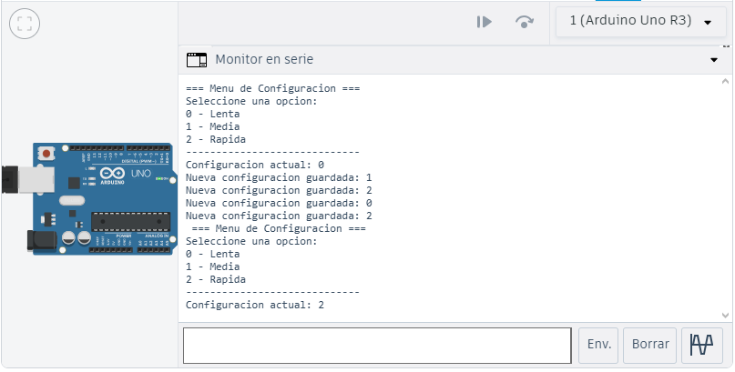

# Reto 2: Menú de Configuración Persistente
#### Objetivo:
Diseñar un sistema de configuración simple que guarde los parámetros en la EEPROM y los restaure al reiniciar.

#### Descripción:

El usuario, a través del puerto serie, debe poder elegir entre 3 opciones de configuración (ejemplo: velocidad de parpadeo de un LED: lenta, media, rápida).
La opción seleccionada se guarda en la EEPROM.
Al reiniciar el Arduino, debe leer la configuración almacenada y ejecutar el comportamiento correspondiente sin necesidad de volver a configurarlo.
#### Puntos a considerar:

Usar EEPROM.put() y EEPROM.get() para almacenar variables.
Crear un menú básico usando Serial.read().

## Montaje en Tinkercad

### Link Tinkercad
https://www.tinkercad.com/things/7nbkvovvmXo-eeprom-guarda-config?sharecode=Nt2VPC8bjmAtv3jWrUt-jVSvGpMo8YAWXxLfl0KCV5I
