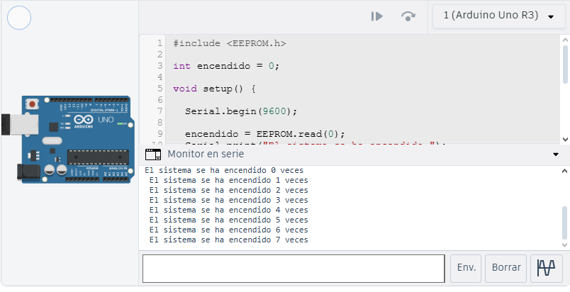

# Reto 1: Contador Persistente de Encendidos
#### Objetivo:
Programar el Arduino para que cuente cuántas veces se ha encendido el sistema y almacenar este valor en la EEPROM.

#### Descripción:
Cada vez que el Arduino se energiza, debe:

Leer el valor actual del contador desde la EEPROM.
Incrementar el contador en 1.
Guardar el nuevo valor en la EEPROM.
Mostrar el número de encendidos por el puerto serie.
#### Puntos a considerar:
Usar EEPROM.read() y EEPROM.write().
Evitar escribir en cada ciclo del loop(), solo al iniciar.
## Montaje en Tinkercad

### Link Tinkercad
https://www.tinkercad.com/things/6pT0OKwJK1o-eeprom-contador?sharecode=ddlrQcX6fmZWMF7SNse1hUGJoPFjTRMtYZxHcp6hoFU
