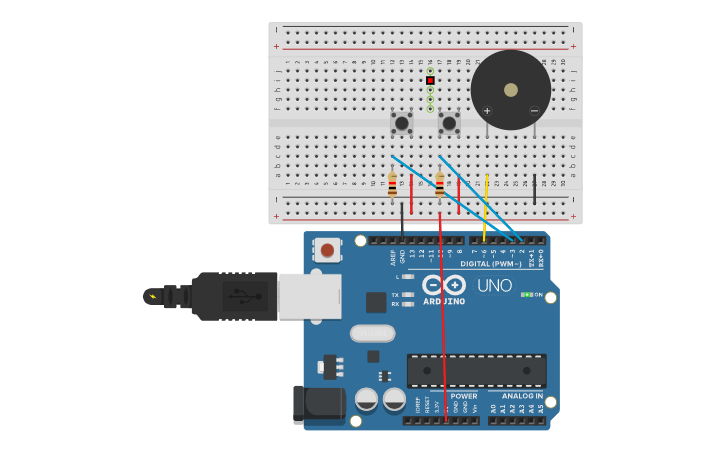

# Reto 5: Sistema de alarma con múltiples interrupciones
Descripción:
Un sensor (ej. PIR o un pulsador) conectado al pin 2 genera una interrupción externa al detectar movimiento.
Al activarse, empieza a sonar un buzzer con frecuencia variable usando interrupción por Timer2.
La alarma se detiene al presionar otro botón conectado al pin 3 (INT1).
Objetivo: Integrar múltiples fuentes de interrupción (externas e internas) en un sistema con diferentes estados.
## Montaje en Tinkercad

### Link Tinkercad
https://www.tinkercad.com/things/g2k6mB2fcxP-alarma-interrupcion-int?sharecode=dTmNq9s3wq-7eVEUN6zb5kS5jORI1KbDp9SSALCQirI
