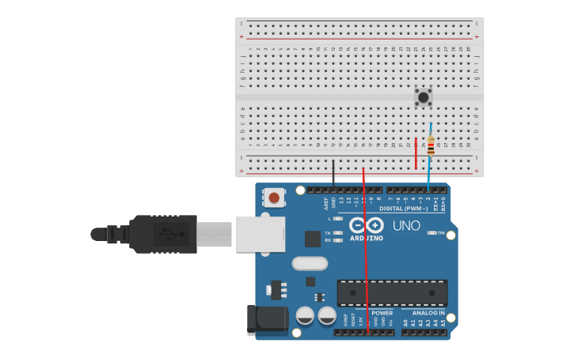

# Reto 4: Medición de frecuencia de una señal externa
Descripción:
Conectar un sensor que genere pulsos (ej. sensor de efecto Hall, encoder, o un simple botón).
Configurar una interrupción externa en el pin 2 para contar pulsos.
Usar un timer interno que genere interrupción cada 1 segundo.
Al cumplirse, calcular y mostrar la frecuencia (pulsos/segundo) en el monitor serial.
Objetivo: Combinar interrupciones externas e internas para medir frecuencia.
## Montaje en Tinkercad

### Link Tinkercad
https://www.tinkercad.com/things/1NWfepNjzGv-frecuencia-interrupcion-int?sharecode=LjUkfT43vkxUfT3PEWvgPt23P3o45E2cS28FyTFadS8
