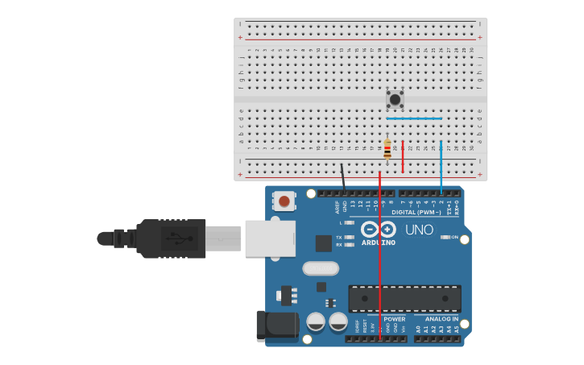

# Reto 1: Contador con botón (Interrupción externa)
Descripción: Conectar un pulsador al pin 2 (INT0). Cada vez que se presione, incrementar un contador.
Requisito extra: Mostrar el valor en el puerto serial.
Objetivo: Comprender cómo usar interrupciones externas para responder a eventos asincrónicos evitando el polling.
## Montaje en Tinkercad

### Link Tinkercad
https://www.tinkercad.com/things/jMovI4OisbI-contador-interrupcion?sharecode=BgYbV8612GYlcGUgJfv6tFgsh6n3ZznKca0CC3fgMXg
