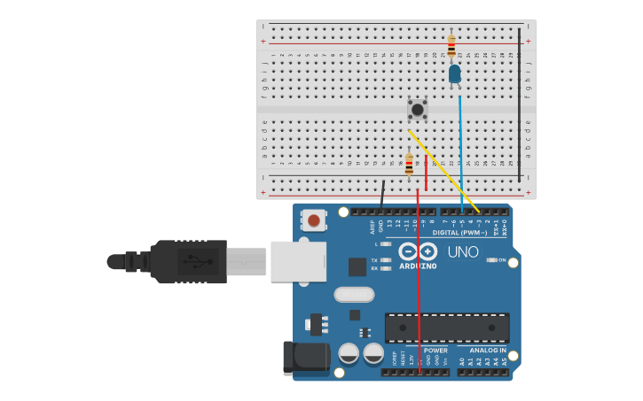

# Reto 2: Control de PWM con interrupción
Descripción: Usar analogWrite() en un pin PWM para controlar la intensidad de un LED.
Con un botón en el pin 3 (INT1), invertir la dirección del cambio:
Si estaba aumentando el brillo, ahora disminuye.
Si estaba disminuyendo, ahora aumenta.
Objetivo: Combinar interrupciones externas con la generación de señales PWM.
## Montaje en Tinkercad

### Link Tinkercad
https://www.tinkercad.com/things/5bBAS1E7YB0-dimmer-interrupcion?sharecode=bnVWQ_OUvMWi30_OYLeJ3pprnarR4DOeGGpY1vRRoFg
