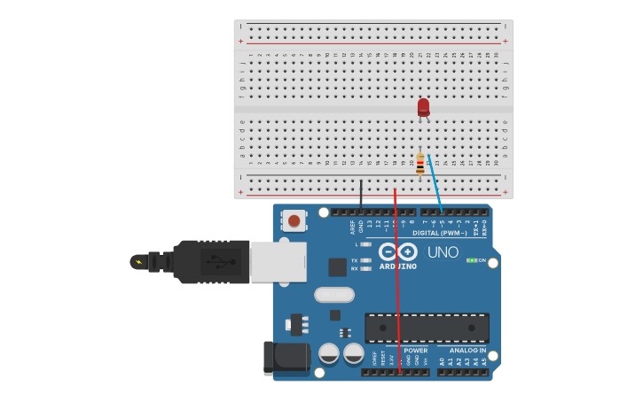

# Reto 3: Temporizador interno para parpadeo preciso
Descripción: Usar Timer1 en modo CTC para generar una interrupción cada 500 ms.
En la ISR, invertir el estado de un LED.
Objetivo: Demostrar cómo los timers internos permiten controlar el tiempo sin usar delay().
## Montaje en Tinkercad

### Link Tinkercad
https://www.tinkercad.com/things/foMgK1yiWea-timer-interrupcion-int?sharecode=RG0JrcNsbcCHiz-Qe8ZLEJ0LmGTAAylVJbsz3PNfgog
