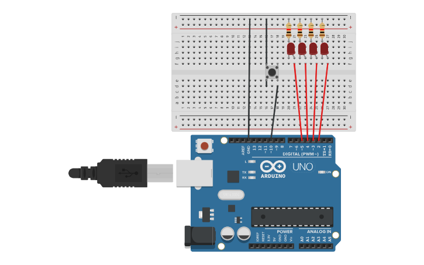

# Reto 4: Contador Binario con LEDs
Usar cuatro LEDs para representar un número binario.
Un botón incrementará el número en binario (0 a 15).
Al llegar a 15, volverá a 0.
## Montaje del circuito en Tinkercad

### Link Tinkercad
https://www.tinkercad.com/things/lGhsZTF0JW3-binario-4-bits?sharecode=jJjwTf_Auw3wFJqyGQ6cAAZkCKHlJ9xKAT7Stuz_i9w
