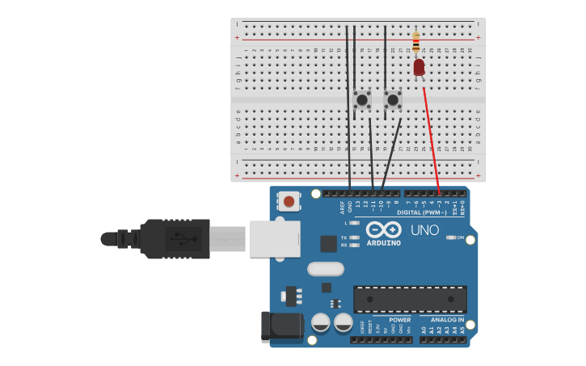

# Reto 5: Control de Brillo con Pulsadores (PWM)
Usar un LED y dos botones.
Un botón aumentará el brillo del LED.
Otro botón disminuirá el brillo.
Implementar el control mediante PWM.
## Montaje del circuito en Tinkercad

### Link Tinkercad
https://www.tinkercad.com/things/iv5ybo1Zvcp-dimmer?sharecode=7tTuH0CPDToziuSc7pqYUOScd1-F7s3MBGe6uZ7NuMQ
