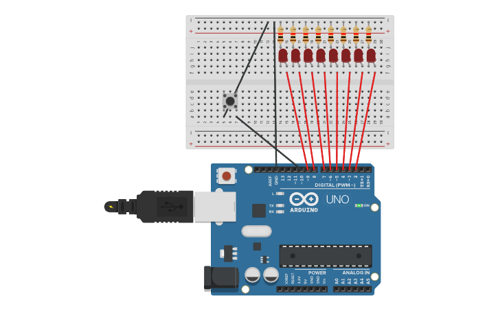

# Reto 2: Secuencia de LEDs
Usar 8 LEDs.
Al presionar el botón, los LEDs deben encenderse en secuencia.
Al soltarlo, los LEDs deben apagarse en orden inverso.
## Montaje del circuito en Tinkercad

### Link Tinkercad
https://www.tinkercad.com/things/csV0tnEgWV7-secuencia-leds?sharecode=rOg8X5vk-wZQZ-BkF_B6zj0NSiP2o_Vn-1LLms1KKGkv
