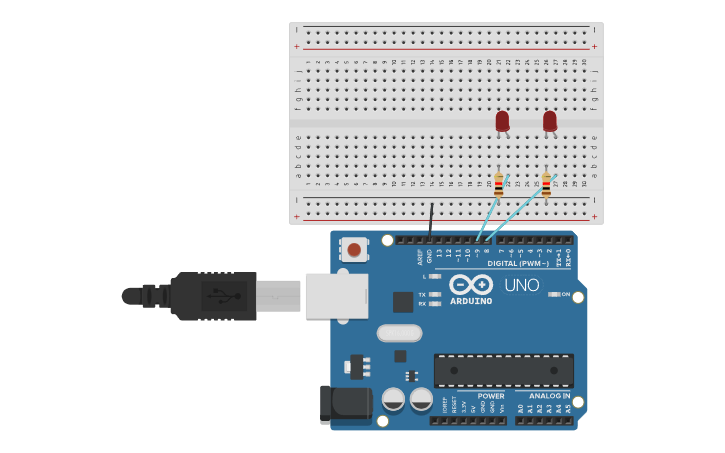

# Reto 1: Parpadeo multitarea (Hello RTOS)
#### Objetivo: 
Introducir el concepto de tareas concurrentes en RTOS.

#### Descripción:

Crear dos tareas independientes:
Tarea 1: Encender y apagar un LED cada 500 ms.
Tarea 2: Encender y apagar otro LED cada 1000 ms.
Observar que ambas tareas funcionan sin necesidad de delay().

## Montaje en Tinkercad

### Link Tinkercad
https://www.tinkercad.com/things/gtiVI3Sz17i-hello-rtos?sharecode=0F06TN6iZfQZfUYzN62w6GKcvYJDChMm9pf1UZCuH_I
